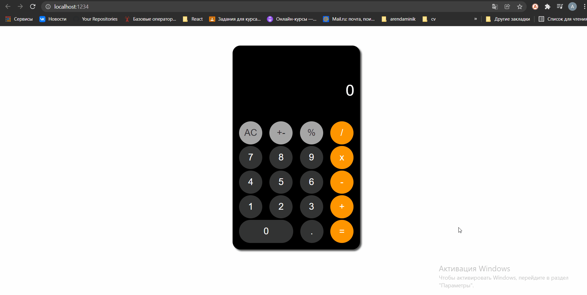

# calculator
## Калькулятор без eval() c ограничением по макс. числу и множеством проверок.

1. `git clone https://github.com/AntonBoreiko/calculator.git`
2. `cd ./calculator`
3. `npm install`
4. `npm run dev `

